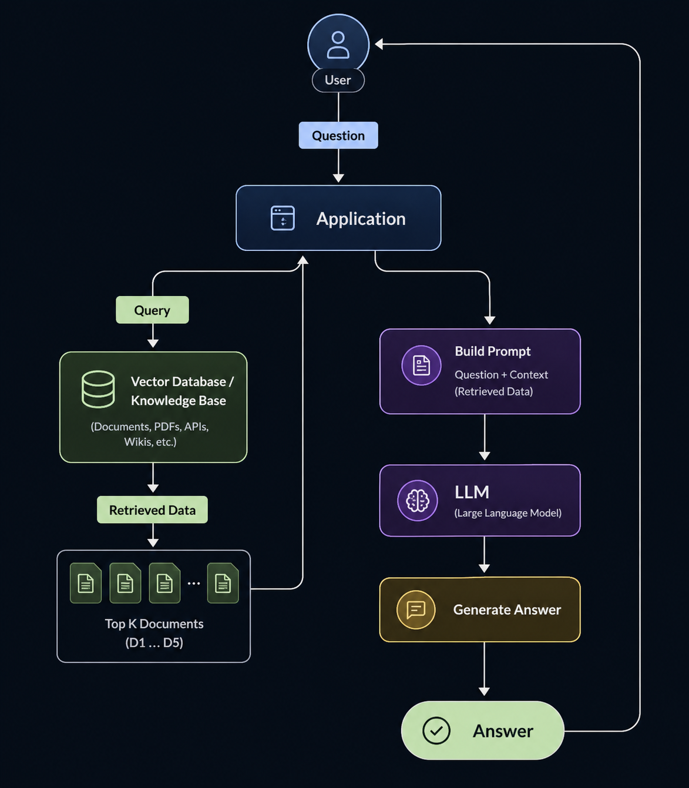

# Agentic RAG

This module teaches you how to build a RAG pipeline with keyword search and make it agentic with function calling.

You can think of RAG as giving an AI access to a searchable knowledge base. When a user asks a question, the system first retrieves the most relevant documents and then uses the context to generate an answer.

RAG allows you to access the information that LLM doesn't know.
