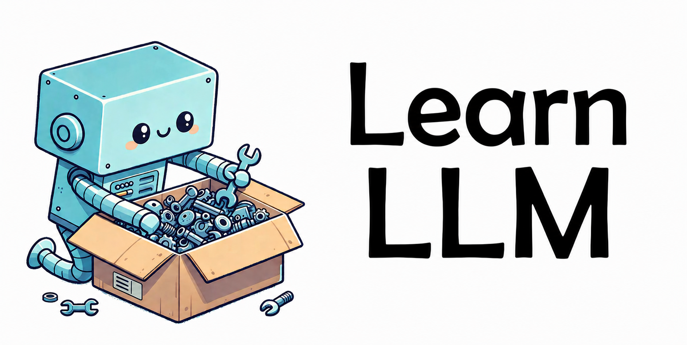

<h1>Learn LLM: Building LLM Applications with RAG, Agents & Vector Search</h1>
<h3>Go from LLM basics to a production-ready AI assistant</h3>

Learn Retrieval-Augmented Generation, vector search, embeddings, AI agents, function calling, evaluation, monitoring, hybrid search, reranking, and more.

⭐ Star this repo to stay updated.

## About the Course

This course teaches you how to build practical, production-ready LLM applications step by step. You'll learn Retrieval-Augmented Generation, vector search, embeddings, AI agents, function calling, evaluation, monitoring, hybrid search, reranking, and more - all free, open-source, and hands-on.

## Prerequisites

- Python: You can write code confidently
- Command Line: Comfortable with terminal
- Docker: Basic familiarity
- ML / LLMs: Not required
- Hardware: Any laptop or PC. No GPU needed
- Expenses: ~$1-5 in API credits

> [!NOTE]
> If you can write a Python function and have heard of ChatGPT, you have enough to get started.

## Syllabus

### [Module 1: Agentic RAG](01-agentic-rag/)

- Build a RAG pipeline with keyword search
- Make it agentic with function calling

### [Module 2: Vector Search](02-vector-search/)

- Semantic search with embeddings
- minsearch, sqlitesearch, and PGVector

### [Module 3: Orchestration](03-orchestration/)

- AI orchestration with Kestra

<!-- ### [Workshop: Data Ingestion](cohorts/2026/workshops/dlt.md)

- Pull traces from a monitoring service for analytics with dlt -->

### [Module 4: Evaluation](04-evaluation/)

- Measure retrieval and answer quality
- Offline and online evaluation

### [Module 5: Monitoring](05-monitoring/)

- Monitor user feedback and system health
- Live dashboards

### [Module 6: Best Practices](06-best-practices/)

- LangChain
- Hybrid search: combine vector and keyword search
- Rerank results for higher precision

### [Module 7: End-to-End Project](07-project-example/)

- A complete project example: a fitness assistant built with LLMs

### [Capstone Project](project.md)

- Ship a complete end-to-end project of your choice from scratch

## Capstone Project

You'll build a complete, working RAG application.

You'll build a searchable knowledge base, a retrieval pipeline, an evaluation process, a user-facing interface, and monitoring & feedback loops.
